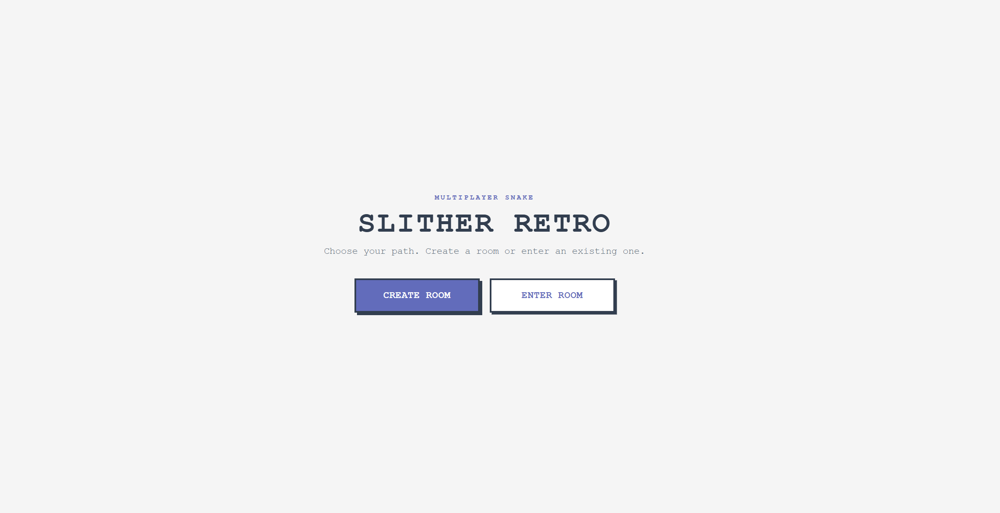
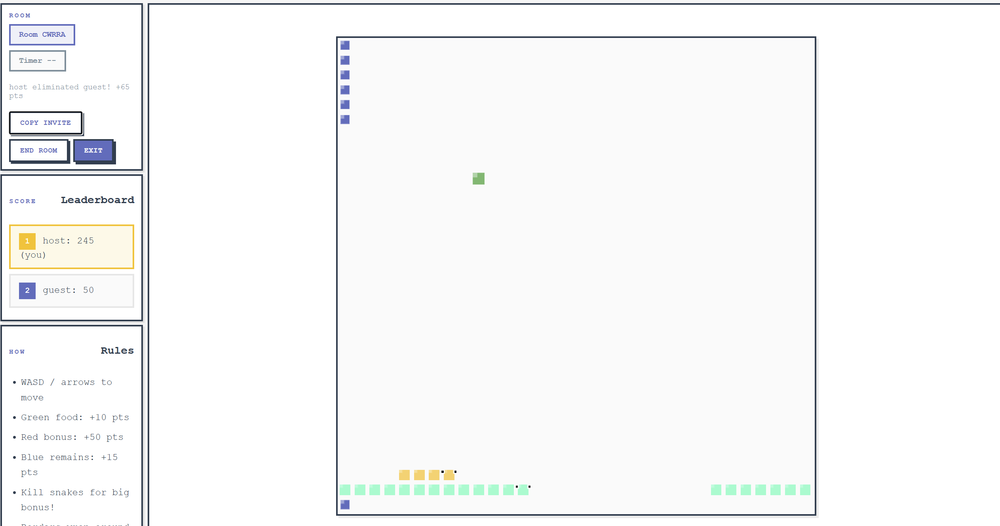

# 🐍 Slither Retro

A competitive multiplayer snake game with a clean, pixelated aesthetic inspired by Crossy Road. Built for intense PvP action with wraparound borders, kill bonuses, and body decomposition mechanics.



## ✨ Features

### 🎮 Competitive Gameplay
- **PvP-Focused**: Eliminate opponents to earn massive bonuses
- **Wraparound Borders**: No walls—snakes seamlessly cross from edge to edge
- **Kill Rewards**: Earn points and growth based on your victim's size
- **Body Decomposition**: Eliminated snakes leave behind collectible remains for 10 seconds

### 🎨 Clean Pixelated Design
- Minimalist Crossy Road-inspired aesthetic
- No glow effects or visual noise—pure, crisp squares
- Monospace typography and bold borders throughout
- Satisfying box-shadow animations on all interactions

### 🎯 Game Mechanics
- **Green Food** (+10 pts): Standard growth
- **Red Bonus** (+50 pts): Rare spawns with extra growth
- **Blue Remains** (+15 pts): Collect from eliminated players
- **Kill Bonus**: 30 + (victim's length × 5) points
- **Dynamic Scoring**: Bigger victims = bigger rewards

### 👥 Multiplayer
- 1-4 players per room with shareable invite links
- Host controls: Adjustable map size (16-64), speed (1-5), player slots, and optional timer
- Real-time leaderboard with top 5 players
- Room codes for easy joining
- **Team Deathmatch Mode**: Choose teams in lobby, compete for team supremacy
- **Spectator Mode**: Late joiners watch the action in team matches

### 🎭 Smooth UX
- Two-stage flow: Clean landing → immersive game screen
- Conditional form display (Create/Join only shows when needed)
- Auto-populated room codes from invite links
- WebSocket-based real-time updates

## 🚀 Quick Start

### Installation
```bash
npm install
```

### Development
```bash
npm run dev
# Opens on http://localhost:3000
```

### Production
```bash
npm start
```

## 🎯 How to Play

### Getting Started
1. **Create a Room** or **Enter Room** from the landing page
2. Customize settings (host only):
   - Game Mode: Classic or Team Deathmatch
   - Map size: 16-64 tiles
   - Speed: 1-5 (faster = harder)
   - Max players: 1-4
   - Timer: 0-30 minutes (optional)
3. **For Team Deathmatch**: Choose your team in the lobby (Team 1 or Team 2)
4. Host starts the match once teams are ready
5. Share the invite link with friends

### Controls
- **WASD** or **Arrow Keys** to move
- No reversing allowed (can't go back on yourself)

### Scoring System
| Item | Points | Effect |
|------|--------|--------|
| Green Food 🟢 | +10 | Standard growth |
| Red Bonus 🔴 | +50 | Extra growth burst |
| Blue Remains 🔵 | +15 | From eliminated players |
| **Player Kill** 💀 | **30 + (victim size × 5)** | **Major bonus + growth** |

### Strategy Tips
- 🎯 Hunt larger snakes for bigger kill bonuses
- 🔄 Use wraparound borders to escape or ambush
- 💎 Collect blue remains after kills for quick recovery
- ⚡ Speed setting affects tick rate—higher speeds = faster reactions needed
- 🧠 Remember: Eliminated snakes respawn, but their remains vanish after 10s
- 🤝 **Team Mode**: Coordinate with teammates! Team kills add to your team score
- 👥 **Team Mode**: Avoid crashing into teammates—friendly collisions still hurt!
- 👀 **Spectator**: Join mid-match in team games to watch the battle unfold

## 🛠️ Tech Stack

- **Frontend**: Vanilla JavaScript + Canvas API
- **Backend**: Node.js + Express + WebSocket (ws)
- **Styling**: Custom CSS with pixelated design system
- **State Management**: Server-authoritative game loop

## 📁 Project Structure

```
slither-retro/
├── docs/               # Documentation
│   ├── DEPLOYMENT.md   # Deployment guide
│   └── TEAM_MODE_GUIDE.md  # Team mode documentation
├── public/
│   ├── client.js       # Game rendering & client logic
│   ├── index.html      # Main HTML structure
│   └── style.css       # Pixelated design system
├── server.js           # WebSocket server & game logic
├── package.json
└── README.md
```

## 📚 Documentation

- **[Deployment Guide](docs/DEPLOYMENT.md)** - How to deploy to Render, Railway, and other platforms
- **[Team Deathmatch Guide](docs/TEAM_MODE_GUIDE.md)** - Complete guide to the team mode feature

## 🎮 Game Logic Highlights

### Collision Detection
- **Player vs Player**: Victim decomposes, killer gains bonus
- **Player vs Food**: Growth and points
- **Border Collision**: Wraparound (no death)
- **Team Mode**: Friendly fire causes collision (careful with teammates!)

### Server Authority
- All game state managed server-side
- Client receives updates via WebSocket
- Prevents cheating and ensures synchronization

### Tick System
- Base tick: 140ms
- Adjusted by speed: `max(60ms, 140ms - (speed - 1) × 18)`
- Speed 5 = 68ms tick (very fast!)

## 🎨 Design Philosophy



This game embraces a **brutalist, pixelated aesthetic**:
- ✅ Sharp squares and hard borders
- ✅ Monospace fonts (Courier New)
- ✅ Box shadows instead of soft shadows
- ✅ No rounded corners, no gradients, no glow effects
- ✅ Flat colors with minimal highlights
- ✅ Crisp, pixelated rendering

Inspired by Crossy Road's clean visual language and Agar.io's competitive multiplayer dynamics.

## 🤝 Contributing

Feel free to fork, modify, and submit PRs! Some ideas:
- Additional power-ups
- More player slots
- Tournament brackets
- Custom color palettes
- Voice chat integration
- Replay system

## 📝 License

MIT License - feel free to use this for your own projects!

## 🎯 Roadmap

- [x] Team Deathmatch mode
- [x] Spectator mode
- [ ] Replay system
- [ ] Achievement system
- [ ] Additional game modes (capture the flag, king of the hill, etc.)
- [ ] Power-ups and special abilities

---

**Built with 💜 by a developer who thinks glowing effects are overrated**

Enjoy the game! 🐍✨
